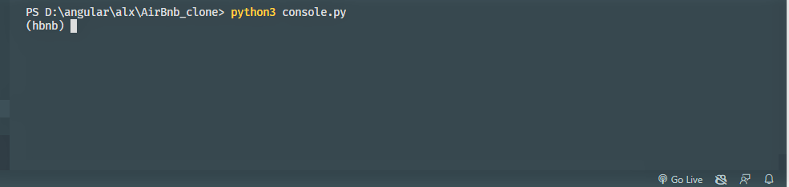
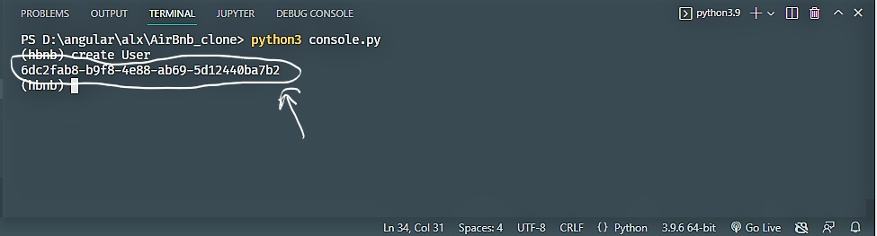
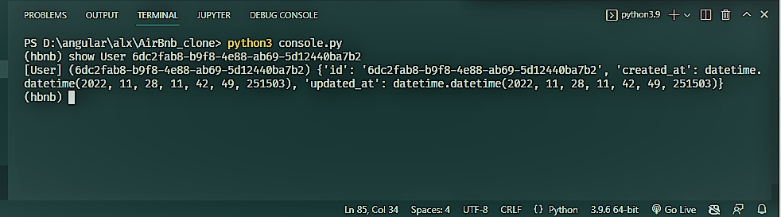
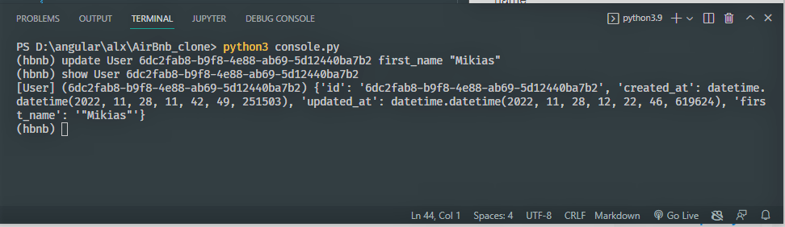
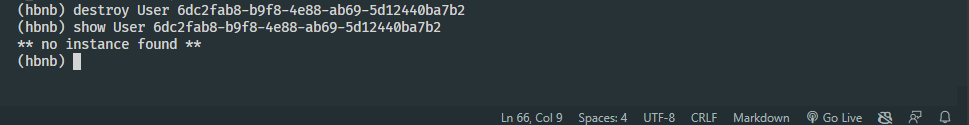

# AirBnB Clone - The Console

 The first piece is to manipulate a powerful storage system. The storage engine will give us an abstraction between "object" and "How they are stored and persisted". This means from your console code you can access the stored object without knowing and worrying about it :joy:.

## How it works
---
### Step #1
`git clone https://github.com/mikek1337/AirBnb_clone.git`

### Step #2

`python3 console.py`

### Step #3

```
(hbnb) create <Class_name>
<object_id>
(hbnb) 
```

Congragulations you create and save you first model :thumbsup:
### Searching for object #4
Now you created an object and saved it let search for it.:punch:
```
(hbnb) show <Class_name> <object_id>
{
    [class_name] (object_id) {
        attributes
        ...
    }
}
```
### Updating object #5
But now you realized you need to update object how are you going to do that no worry we got you.:v:
```
(hbnb) update <class_name> <object_id> <new_attribute> <value>
```

### Destroy object #6
To delete object from the storage.
```
(hbnb) destroy <class_name> <object_id>
```


### For more information 
---
`(hbnb) help <command>`

display's information about the command you are interested in.

### Example
Launch program

[](#step-2)

Creating and saving object. The marked area is you object id needed for search, update and delete object on the storage.

[](#step-3)

Searching for the object is easy you need ==**object name**== and ==**object id**==.

[](#searching-for-object-4)

updating the object to add attribute and value to it. For this example let's add first name.

 [](#updating-object-5)

What if you wanted to destroy the object form storage :bomb:

[](#destroy-object-6)


